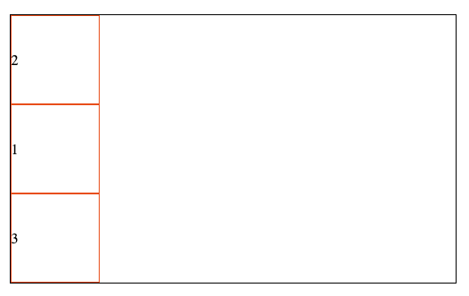

# Flex 布局

## 在容器上面设置的：

> `display: flex` ,`flex-direction`, `flex-wrap`, `justify-content`,`align-items`, `align-content` 

1. `display: flex`

> 设置这个盒子为一个flex弹性盒子

2. `flex-direction`

> 方向默认是`row`就是横向的 ，可以设置`column`纵向，`row-reverse`横向反转（从右往左）,`column-reverse`（纵向反转，从下往上） 

3. `flex-wrap`

> 默认`nowrap`，不换行，多的话，就把每个宽度缩小，可以通过设置成 `wrap` 根据每个子元素的宽度来让他换行

4. `justify-content`

> 基于主轴做一个对齐方式，比如容器500px，每个子元素100px，则占不满，会根据设置的属性来排列

+ `flex-start` 
> 靠主轴左边排

+ `flex-end`
> 靠主轴右边边排

+ `center` 
> 靠主轴中间排列

+ `space-between` 
> 两边占住，中间间距平均分配

+ `space-around` 
> 保持子元素的左右都会空出来一定距离，两个元素之间则是两倍的距离，因为两个元素之间的间距=一个元素右边+一个元素左边

5. `align-items`

> 基于交叉轴做一个对齐方式

+ `flex-start`
> 靠交叉轴上边排

+ `flex-end` 
> 靠交叉轴下边边排

+ `center` 
> 靠交叉轴中间排列

+ `baseline` 
> 根据元素里面的文字内容来进行排列,比如把第一个元素设置上边距20px，那后面的都会跟着一起下来排列

+ `stretch` 
> `align-items`的默认就是这个属性，如果子元素没有设置高度，正常情况下会根据内容来撑开高度，但是属性为这个值的情况下，会自动 将没有设置高度的子元素 的高度 撑开至容器的高度

6. `align-content` 

> 多行元素 基于交叉轴做一个对齐方式 

+ `flex-start` 
> 多行元素 靠交叉轴上边排

+ `flex-end` 
> 多行元素 靠交叉轴下边边排

+ `center`
> 多行元素 靠交叉轴中间排列

+ `space-between` 
> 上下占住，中间间距平均分配（跟 `justify-content` 类似只不过这是基于交叉轴的）

+ `space-around` 
> 保持子元素的上下都会空出来一定距离，两个元素之间则是两倍的距离，因为两个元素之间的间距=一个元素右边+一个元素左边 （跟 `justify-content` 类似只不过这是基于交叉轴的）

+ `stretch` 
>如果子元素没有设置高度，会自动 将没有设置高度的子元素 的高度 撑开至容器的高度

## 在子元素上面设置的：

> `order`

1. `order`

> 默认为0，在子元素上设置，谁小，谁就靠主轴的前面，如果主轴是横向，那小的就在左边，大的就在右边，如果主轴是纵向，那小的就在上边，大的在下边
> 如下图就是元素2和元素1均设置了负值，且元素2设置了比元素1小，元素3是默认值0，则元素2为最小放在了左（上）边，元素3最大放在了右（下）边

2. `align-self`

> 用于设置子元素自己在交叉轴上的位置，优先级高于父级上设置的 `align-items`，低于`align-content` 
> 未设置这个属性的子元素，则根据父级上设置的`align-items`来决定交叉轴上的位置

> 如下图，父级上设置了`align-items: center`， 给元素1设置了`align-self:flex-start`，给元素2设置了`align-self:flex-end` 的效果，以表明优先级高于 `align-items`

3. `flex-grow`

> 当前容器的主轴方向上还有剩余空间的时候，设置了`flex-grow`的子元素就会根据自己设置的比例来瓜分剩余的空间

> 如下图，一开始没有设置，然后设置了`flex-grow: 1`，即三个子元素设置的比例为1:1:1，那他们就会按照这个比例来瓜分剩余的空间，以占满主轴方向

> 图三设置了元素1的`flex-grow: 0`，元素2的`flex-grow: 1`，元素3的`flex-grow: 2`，那他们的比例就是0:1:2，也就是剩余的空间，元素1没他的份，被元素2和3以1:2的比例瓜分了

> 以上均是以横向为主轴的例子，纵向的当然同理

4. `flex-basis`

> 这个属性可以决定子元素的宽度，优先级高于width，默认值是`auto`也就是根据width来

> 只给元素写了`flex-basis`或者`flex-basis > width` 即代表元素的最小宽度。
> 设置了 `width` 并且 `flex-basis < width` ，则`flex-basis < 真实宽度 <  width` 

> 如下图，容器500px，给每个元素设置 `width: 100px; flex-basis: 150px` ，元素1跟元素2设置`flex-grow: 1;`,元素3设置`flex-grow: 3`，那么元素1和元素2的宽度就是150px优先级高于width，剩余的`500px-150px*3=50px`被瓜分成1:1:3的比例分配，那么元素1和元素2就都是160px了

5. `flex-shrink`

> 这个属性来决定当子元素宽度加起来超过容器的时候，每个子元素应该缩小的宽度
> 如果元素内的是不换行的内容（英文）则这个元素就不会参与压缩，如果想参与压缩，可以设置`word-break:break-word`

> 如果当前的容器宽度为`600px`，元素1和元素2的`width:200px，flex-shrink: 1`，元素3`width:400px; flex-shrink: 3`，则超出了200px，此时就需要按照一定的计算方式来让三个元素各缩小对应的宽度来适应这个容器.

> 先获得一个加权值 即 `200px*1+200px*1+400px*3 = 1600px` 
> 然后元素1和元素2的缩小宽度就是 `(200px*1 / 1600px)*总超出的200px = 25px`，则元素1元素2就变成了`200px-25px=175px`，
> 元素3的缩小宽度是`(400px*3/1600px)*200px=150px`,元素3就变成了`400px-150px=250px`
>（元素1真实内容区大小*shrink + 元素2真实内容区大小*shrink + 元素3真实内容区大小*shrink） = 加权值

